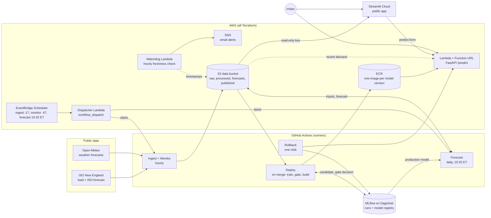
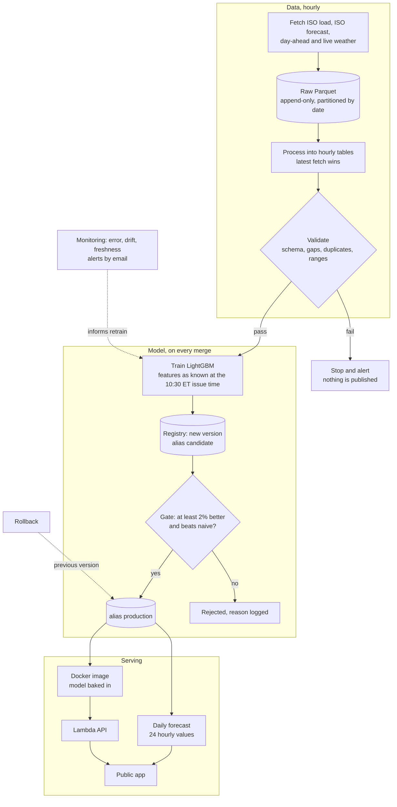
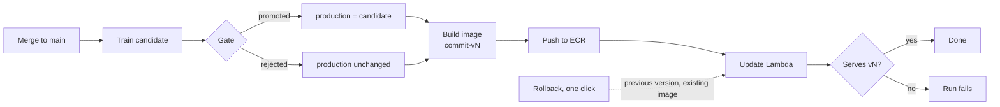

# New England Electricity Demand Forecasting Pipeline

A live pipeline that forecasts next-day hourly electricity demand for New England and runs
unattended, with every model decision visible on a public dashboard. The operating pipeline is
the product; the forecast is its workload. Forecasts are benchmarked against ISO New England's
own load forecast and a naive same-hour-last-week baseline.

> Status: **Phase 6 done — monitoring live; on its first day it caught a forecast job that never started.**
>
> **[Live forecast app](https://ne-demand-forecast-njvzyctwntwcxquaahetkb.streamlit.app/)** ·
> **[Experiments and model registry (MLflow on DagsHub)](https://dagshub.com/vladimir-kazarin/ne-demand-forecast.mlflow)** ·
> **[Prediction API](https://ycw52embas2yt2mdbaucbkyt4e0upcey.lambda-url.us-east-1.on.aws/health)** (`POST /predict`)

## Results at a glance

| | |
| --- | --- |
| Forecast error, last 28 days (MAPE) | **6.5%** model · 12.3% naive baseline · 1.2% ISO same-day¹ |
| Gate | Degraded model (17.7% MAPE) rejected automatically; retrains on unchanged data rejected by the 2% margin |
| Rollback | **53 s** in the job, 69 s from click to a verified API (target: 5 min) |
| API latency | p95 **105 ms** locally, 72 ms over the internet (target: 200 ms locally) |
| Running cost | Under $1/month (S3, ECR, Lambda free tier); $20 budget alarm |

¹ ISO's same-day forecast is issued on the day it covers, so it knows more than a day-ahead model.
The fair day-ahead comparison accumulates from Oct 2, 2026, when live archiving began.

## Architecture



AWS EventBridge Scheduler decides *when* jobs run and a dispatcher Lambda starts them on
GitHub Actions; GitHub's own cron skipped too many runs ([ADR 0009](docs/adr/0009-scheduling-on-eventbridge.md)).
A watchdog Lambda checks freshness from inside AWS and emails alerts through SNS.
GitHub Actions signs in to AWS with short-lived OIDC tokens (no stored keys), and only from
`main`. Its role can read and write the data bucket but not delete, so raw data is append-only.

## Pipeline



Every registration, gate decision, promotion and rollback is tagged on the model version and
appended to `published/model_events.parquet`, which the dashboard's model timeline reads.

## Roadmap, decisions, and tradeoffs

v1 is phases 0–2. A phase is done when its **done-when** check passes. Each phase lists the main
decisions and what they cost; the full reasoning is in the [decision records](docs/adr/).

### Phase 0 — Setup ✅
- [x] Repository, project scaffold, CI
- [x] Confirm the weather API offers archived forecasts for the backfill period ([ADR 0002](docs/adr/0002-data-sources-and-forecast-vintages.md))
- [x] AWS storage and GitHub OIDC role provisioned with Terraform ([ADR 0003](docs/adr/0003-terraform-for-aws.md))
- [x] Register an ISO Express account
- [x] Backfill two years of load, ISO forecast, and forecast weather into raw storage
- [x] Start archiving the ISO forecast and weather forecast as issued
- [x] **Done when:** historical load and weather are in storage

| Decision | Why | Tradeoff |
| --- | --- | --- |
| Store API responses unchanged, append-only, partitioned by date | Any table can be rebuilt; a bad fetch never overwrites good data | A full rebuild from S3 takes about 9 minutes |
| ISO-NE public files via `gridstatus`, no login | Zero setup, two years backfilled in minutes | History keeps only ISO's same-day forecast, so the fair day-ahead benchmark must be archived live and builds up over time |
| Train on Open-Meteo *forecast* weather (Previous Runs API), not observed | The model sees what it would have known when issuing | Training lead time is about 24 h; live forecasts are 14–38 h ahead |
| Terraform from day one (the PRD deferred it) | Every AWS resource is reviewable and reproducible | A separate bootstrap stack for the state bucket |
| GitHub Actions cron for scheduling (replaced in Phase 6, [ADR 0009](docs/adr/0009-scheduling-on-eventbridge.md)) | Free, lives in the repo | Dropped most hourly runs on day one and never started a forecast on day three ([incident log](docs/incidents.md)) |

### Phase 1 — Batch forecast with validation ✅
- [x] Hourly ingestion job: idempotent, retries, alerts on failure
- [x] Pandera validation: schema, missing hours, duplicates, value ranges
- [x] Features: lagged load (24 h, 48 h, 168 h), forecast temperature, calendar ([ADR 0004](docs/adr/0004-issue-time-and-features.md))
- [x] LightGBM training from config
- [x] Daily batch forecast of 24 hourly values, stored with model version
- [x] Naive baseline (same hour last week) scored alongside
- [x] **Done when:** a broken column fails the pipeline with a clear error

| Decision | Why | Tradeoff |
| --- | --- | --- |
| Issue at 10:30 ET the day before; training rebuilds each day as of its issue time | No feature uses data from after the forecast was issued; a test checks every lag | The 24 h lag is unknown for afternoon hours, so a 48 h lag was added |
| One `build_features` for training, batch forecast and API | Training/serving skew is ruled out by construction; a parity test proves it | Training builds features day by day, slower than one vectorized pass |
| Validation fails closed | A broken input never produces a published forecast | One missing hour means no forecast that day (it alerts instead) |
| LightGBM, L1 objective, no solar/cloud inputs yet | Fast, strong tabular baseline that beats naive by half | Misses midday rooftop-solar dips on sunny days, which ISO predicts |

### Phase 2 — Tracking, registry, first dashboard ✅ (v1 live)
- [x] MLflow logging of params, metrics, data window, data hash, git commit ([ADR 0005](docs/adr/0005-mlflow-on-dagshub-and-streamlit-cloud.md))
- [x] Model registry with `candidate` and `production` aliases; lineage tags on every version
- [x] Deployed prediction app with the forecast page ([live](https://ne-demand-forecast-njvzyctwntwcxquaahetkb.streamlit.app/); opens without login, matches the stored forecast)
- [ ] App loads in under 3 s (measured 7–10 s on Streamlit Cloud; open)
- [x] **Done when:** the production version traces to its data and commit

| Decision | Why | Tradeoff |
| --- | --- | --- |
| MLflow on DagsHub | Free, and the MLflow UI is public, so anyone can audit runs and versions | The daily forecast depends on a third-party service being up |
| Lineage as tags on each registry version (commit, data hash, data window, promotion reason) | The registry alone answers "what is in production and what produced it" | Tags are overwritten on re-promotion, so history also goes to the event log |
| Streamlit Community Cloud for the app | Free, public, redeploys on every push | 7–10 s loads (PRD: 3 s); a long-lived read-only key, since it cannot use OIDC |
| The app reads published Parquet and imports no pipeline code | Installs in seconds; the app cannot break the pipeline | A little logic (ISO vintage choice) lives in both places |

### Phase 3 — Serving API ✅
- [x] FastAPI service with `/health` and `/predict` ([ADR 0006](docs/adr/0006-serving-on-lambda.md))
- [x] Docker image, public scale-to-zero deployment (AWS Lambda + Function URL, model baked into the image)
- [x] Predict form in the app
- [x] Load test: local p95 under 200 ms (105 ms local; 72 ms over the internet)
- [x] **Done when:** a bad model path fails at startup

| Decision | Why | Tradeoff |
| --- | --- | --- |
| Lambda + Web Adapter + Function URL (over Cloud Run) | Same image runs locally and on Lambda; same AWS account, Terraform and OIDC | Cold starts of 3–4 s; the account's 10-concurrency limit caps bursts near 100 req/s (429s) |
| Model baked into the image, one image per version | Serving never calls DagsHub; rollback is repointing to an existing image | Every promotion needs an image build and deploy |
| Validate the model at startup | A bad path or corrupt model stops the service instead of failing per request | Startup reads the whole model before taking traffic |
| Precompiled bytecode and 2048 MB | Cold-start imports fell from 4.1 s to 1.0 s | Larger image and memory setting (still inside the free tier) |

### Phase 4 — CI/CD, gate, rollback ✅
- [x] PR workflow: lint, unit tests, training smoke test, Terraform validate
- [x] Merge workflow: train and register a candidate, gate it, build and deploy the image ([ADR 0007](docs/adr/0007-cicd-gate-and-rollback.md))
- [x] Evaluation gate on a fixed holdout (MAPE, 2% improvement margin, must beat naive)
- [x] One-click rollback workflow, logged in the registry and the model event log
- [x] **Done when:** a degraded model is rejected ([run](https://github.com/vladimir-kazarin/ne-demand-forecast/actions/runs/37167605349)), and rollback takes under 5 minutes (53 s, [run](https://github.com/vladimir-kazarin/ne-demand-forecast/actions/runs/37167844527))



| Decision | Why | Tradeoff |
| --- | --- | --- |
| Gate on the candidate's holdout, recomputed on current data | Days neither model trained on; each model scored with its own feature config | Only 28 days, so a noisy month can decide |
| Promote only if 2% better *and* better than naive | Retrains on near-identical data cannot churn production | Real improvements under 2% never ship |
| Every merge trains a candidate | Every code change is checked against production with a recorded decision | The registry fills with rejected versions (by design) |
| CI owns the live image; Terraform owns infrastructure | A `terraform apply` can never roll the API back | Terraform state does not show which image is live (ECR and run summaries do) |
| Rollback returns to the version production replaced | One click, no rebuild, about a minute | Not "go to any version"; that is `ne-demand promote` plus a deploy |

### Phase 5 — Scheduled retraining
- [ ] Weekly retrain on a rolling window, sent through the gate
- [ ] **Done when:** the log shows promoted and rejected weeks, each with a reason

| Decision | Why | Tradeoff |
| --- | --- | --- |
| Weekly retrain = the Deploy workflow on a schedule (planned) | Reuses the gate, record and deploy path that already work | Weekly cadence can lag a sudden demand shift |
| ✅ Scheduling moved from GitHub cron to AWS EventBridge Scheduler + a dispatcher Lambda ([ADR 0009](docs/adr/0009-scheduling-on-eventbridge.md)) | Fires on time and handles DST (forecast at 10:32 ET all year); GitHub skipped runs twice in three days | A fine-grained GitHub token to rotate yearly; one more small Lambda |

### Phase 6 — Monitoring and alerts ✅
- [x] Forecast error tracking (model, ISO day-ahead, ISO same-day, naive), daily, rolling 7/30-day
- [x] Input drift: station consistency and out-of-range checks, calibrated on a year of real weeks; PSI/KS context and Evidently reports ([ADR 0008](docs/adr/0008-monitoring-and-drift.md))
- [x] Data freshness and job checks, plus a watchdog Lambda in AWS that catches jobs that never start
- [x] Email alerts through AWS SNS: once when firing, daily reminder, resolved message
- [x] Operations page in the app: health, accuracy, model timeline, drift
- [x] **Done when:** an injected input shift fires an alert within one cycle (+8 °C on Boston detected as a 6.1 °C station shift and emailed in the same cycle, 34 s from dispatch: [run](https://github.com/vladimir-kazarin/ne-demand-forecast/actions/runs/37216322878))

| Decision | Why | Tradeoff |
| --- | --- | --- |
| Forecast error is the primary alarm | Actuals arrive daily, so the outcome itself can be measured | Needs 5 scored days before it can alert |
| Drift alerts only on data faults and extrapolation, not raw PSI | Backtest: raw PSI fired 49 of 49 weeks; these checks fired 2, both real (Arctic outbreak) | A slow, real shift in weather sensitivity shows up in error first, not drift |
| Seasonal reference (same weeks last year) | A fixed reference would alarm every change of season | Needs a year of history; one prior year is a thin baseline |
| Own drift statistics + Evidently 0.6 reports | Explainable alerts; a familiar report for browsing | Evidently 0.7 waits on a plotly version conflict with the ISO-NE client |
| Watchdog Lambda in AWS, not another GitHub job | A job that never starts cannot report itself; GitHub skipped most runs on day one | One more function to deploy (zip, stdlib only) |

### Phase 7 — Showcase
- [x] Architecture diagram
- [x] Decision records for main tool choices
- [ ] Recorded failure demos: validation failure, rejected model ✅, rollback ✅, drift alert ✅
- [ ] Quickstart and incident log
- [ ] **Done when:** a stranger runs it locally within 60 minutes

### Later iterations
- [ ] All eight New England load zones
- [ ] Day-ahead price forecasting and a paper battery trading simulation
- [ ] Airflow and Kubernetes
- [ ] PyTorch challenger model
- [ ] Solar irradiance and cloud-cover features (the largest known accuracy gap)

## Layout

| Path | Stage |
| --- | --- |
| `src/ne_demand/ingestion/` | Hourly pulls of load, ISO forecast, weather; raw-zone storage |
| `src/ne_demand/processing.py` | Raw partitions to hourly processed tables |
| `src/ne_demand/validation/` | Pandera schemas, run before training and forecasting |
| `src/ne_demand/features/` | Calendar and lag features, one code path for training and serving |
| `src/ne_demand/training/` | Config-driven LightGBM training, MLflow tracking and registry |
| `src/ne_demand/evaluation/` | MAPE, the promotion gate, rollback, model event log |
| `src/ne_demand/forecast/` | Daily batch forecast and the naive baseline |
| `src/ne_demand/serving/` | FastAPI service and model bundle |
| `src/ne_demand/monitoring/` | Forecast error, drift checks, freshness, alert de-duplication, the monitoring cycle |
| `dashboard/` | Streamlit app: Forecast and Operations pages |
| `configs/` | Training configs, including a deliberately degraded one for the gate demo |
| `infra/` | Terraform for AWS (state, data bucket, GitHub OIDC role, budget, ECR, Lambda API, dashboard reader, SNS alerts, watchdog, EventBridge schedules + dispatcher) |
| `.github/workflows/` | CI, ingest, forecast, monitor, deploy, rollback (scheduled jobs are started by AWS) |
| `docs/adr/` | Decision records |
| `docs/incidents.md` | Incident log |

## Quickstart

Requires [uv](https://docs.astral.sh/uv/) and Python 3.12.

```bash
uv sync --all-extras          # or: make install
cp .env.example .env          # data root, MLflow (DagsHub) and optional ISO Express credentials
uv run ne-demand check-config
make test

# backfill raw history (resumable) and snapshot today's forecasts
uv run ne-demand backfill --start 2024-09-20 --end 2026-10-01
uv run ne-demand archive

# build processed tables, train, gate, and forecast tomorrow
uv run ne-demand process --start 2024-09-20 --end 2026-10-02
uv run ne-demand train
uv run ne-demand gate
uv run ne-demand forecast
```

### Serving image

```bash
make image          # export the production model, build the image
make serve          # run it on localhost:8090 with ./data
make load-test      # p95 budget 200 ms
```

### Infrastructure

```bash
export AWS_PROFILE=terraform
cd infra/bootstrap && terraform init && terraform apply          # once: state bucket
cd ../aws && cp terraform.tfvars.example terraform.tfvars          # set alert_email
terraform init -backend-config="bucket=$(terraform -chdir=../bootstrap output -raw state_bucket)"
terraform apply
```

All timestamps are UTC. Calendar features are computed in `America/New_York` so 23- and 25-hour
daylight-saving days are handled.
